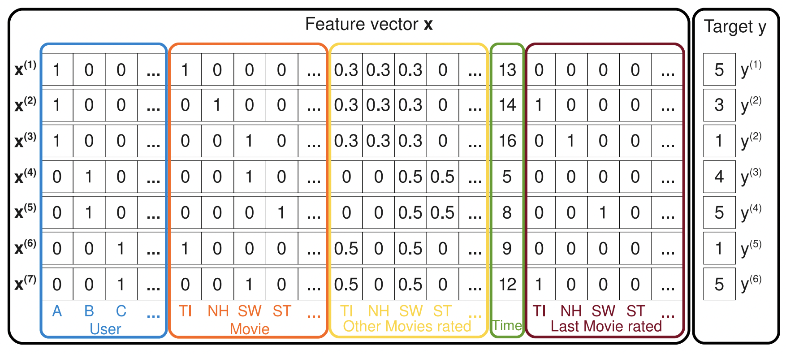

# Factorization Machine (FM) Model

This repository contains a PyTorch implementation of a Factorization Machine (FM) model for recommendation systems.

## Table of Contents

- [Introduction](#introduction)
- [Overview](#overview)
- [Usage](#usage)
- [Dependencies](#dependencies)
- [Example](#example)
- [License](#license)

## Introduction

The Factorization Machine (FM) model is a popular algorithm used in recommendation systems. It is designed to capture interactions between features in a dataset, making it particularly effective for tasks such as collaborative filtering.
- [Paper](https://analyticsconsultores.com.mx/wp-content/uploads/2019/03/Factorization-Machines-Steffen-Rendle-Osaka-University-2010.pdf)
- [Papar review]()


## Overview

### Data



### Model Structure

The FM model predicts the output \(\hat{y}(x)\) based on the provided input data. The model structure is defined by the equation:

$$ \hat{y}(x) := w_0 + \sum_{i=1}^{n} w_i x_i + \sum_{i=1}^{n} \sum_{j=i+1}^{n} \langle v_i, v_j \rangle x_i x_j $$

- $\hat{y}(x)$: Predicted output of the FM model for input \(x\).
- $w_0$: Bias term.
- $\sum_{i=1}^{n} w_i x_i$: Linear term, capturing the contribution of each feature \(x_i\) with its weight \(w_i\).
- $\sum_{i=1}^{n} \sum_{j=i+1}^{n} \langle v_i, v_j \rangle x_i x_j$: Interaction term, modeling feature interactions using factorized weights \(v_i\) and \(v_j\).


## Usage

To use the FM model in your project, follow these steps:

1. Install the required dependencies (see [Dependencies](#dependencies)).
2. Import the `FM` class from the provided code.
3. Create an instance of the `FM` model, passing the feature map as an argument.
4. Prepare your input data and labels.
5. Call the `forward` method on the model with your input data and labels.

## Dependencies

- Python 3.x
- PyTorch

## Example

```python
import torch
from fm_model import FM

# Define the feature map
featuremap = {
    'features': {
        'feature1': {'vocab_size': 5},
        'feature2': {'vocab_size': 10},
        'feature3': {'vocab_size': 3},
    }
}

# Generate input data and labels
input_data = {
    'feature1': torch.randint(0, 5, (1000,)),
    'feature2': torch.randint(0, 10, (1000,)),
    'feature3': torch.randint(0, 3, (1000,))
}
label = torch.randint(0, 1, (1000,))

# Create and use the FM model
model = FM(featuremap)
output = model(input_data, label)
print(output['y_pred'].shape, output['y_true'].shape)
```

## License

This project is licensed under the [MIT License](LICENSE).
